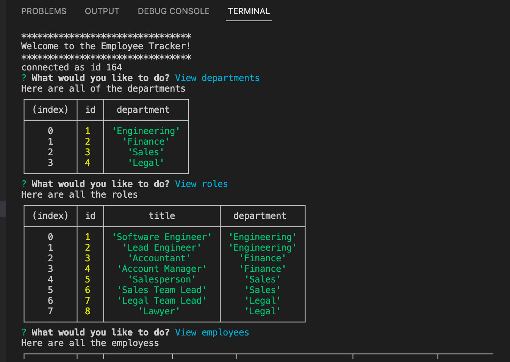

# Employee Tracker 

   

- [Employee Tracker](#employee-tracker)
  - [User Story](#user-story)
  - [Description](#description)
  - [Installation](#installation)
  - [License](#license)
  - [GitHub Repo](#github-repo)
  - [Link to video of working app](#link-to-video-of-working-app)
  - [Questions](#questions)

## User Story
    AS A business owner
    I WANT to be able to view and manage the departments, roles, and employees in my company
    SO THAT I can organize and plan my business

  ## Description
    GIVEN a command-line application that accepts user input
    WHEN I start the application
    THEN I am presented with the following options: view all departments, view all roles, view all employees, add a department, add a role, add an employee, and update an employee role
    WHEN I choose to view all departments
    THEN I am presented with a formatted table showing department names and department ids
    WHEN I choose to view all roles
    THEN I am presented with the job title, role id, the department that role belongs to, and the salary for that role
    WHEN I choose to view all employees
    THEN I am presented with a formatted table showing employee data, including employee ids, first names, last names, job titles, departments, salaries, and managers that the employees report to
    WHEN I choose to add a department
    THEN I am prompted to enter the name of the department and that department is added to the database
    WHEN I choose to add a role
    THEN I am prompted to enter the name, salary, and department for the role and that role is added to the database
    WHEN I choose to add an employee
    THEN I am prompted to enter the employee’s first name, last name, role, and manager, and that employee is added to the database
    WHEN I choose to update an employee role
    THEN I am prompted to select an employee to update and their new role and this information is updated in the database

    
  ## Installation
    -Clone the repo
    -Install node.js: https://coding-boot-camp.github.io/full-stack/nodejs/how-to-install-nodejs
    -Then in the integrated terminal for the cloned repo terminal:
      -npm start

  ## License
      
   

      This project is coverted under the MIT License

  ## GitHub Repo
  https://github.com/jleitz27/employee-tracker

  ## Link to video of working app
 https://www.screencast.com/t/5gnnbeWhk 

  
  

  ## Questions

  If you have any additional questions please contact me:  
      - GitHub: jleitz27  (https://github.com/jleitz27)
      - Email:  jkleitz27@gmail.com